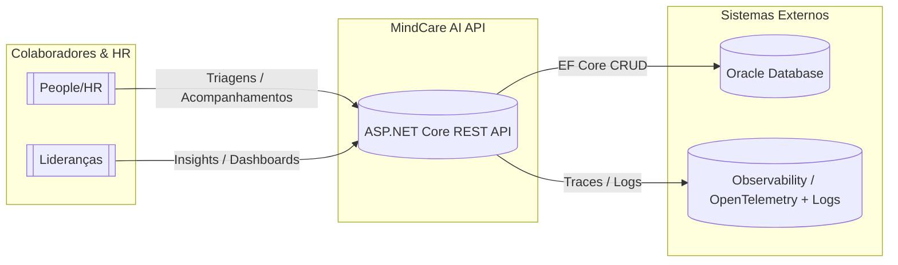
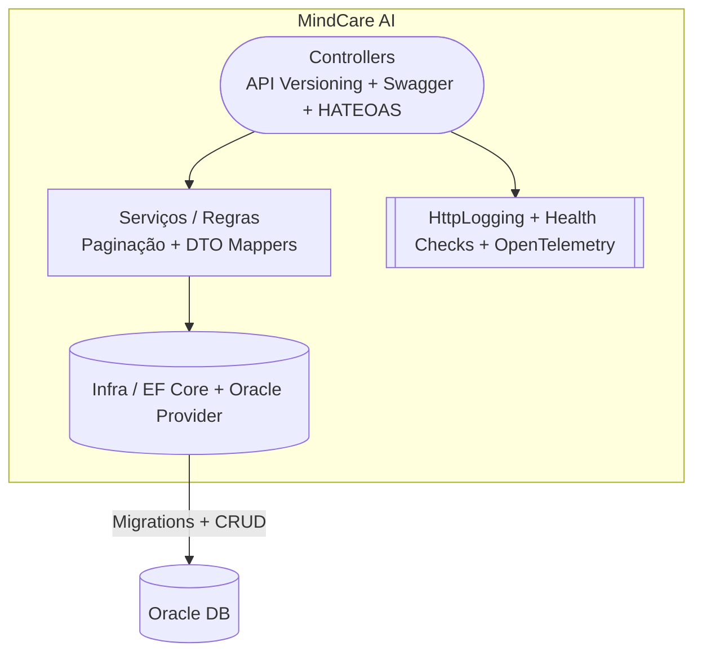

# MindCare AI API

API RESTful desenvolvida em .NET para apoiar o tema **“O Futuro do Trabalho”** oferecendo uma plataforma de cuidado com a saúde mental corporativa. A MindCare AI conecta empresas, usuários e profissionais de saúde para registrar triagens, gerar encaminhamentos inteligentes e acompanhar todo o atendimento em tempo real.

## Descrição do Projeto

Os RHs e as lideranças de empresas carecem de ferramentas para acompanhar o bem-estar emocional dos colaboradores e agir rapidamente quando surge uma situação de risco. A MindCare AI propõe uma solução com:

- Triagens digitais com classificação de risco, histórico de relatos e sugestões de conduta;
- Encaminhamentos para profissionais especializados, recomendados por perfil da empresa;
- Linha do tempo de acompanhamentos para dar visibilidade às lideranças;
- API com paginação, HATEOAS, versionamento (`/api/v1`) e status codes adequados;

**Público-alvo:** times de People/HR, lideranças e profissionais de saúde corporativa que precisam monitorar o clima emocional das equipes híbridas.

---

## Tecnologias Utilizadas

- ASP.NET Core 9 (Controllers, Swagger/OpenAPI, HttpLogging);
- [aspnet-api-versioning](https://github.com/dotnet/aspnet-api-versioning) com URL, header e query string;
- Entity Framework Core 7 + Oracle EF Core Provider (migrations completas);
- Oracle Database (migrations criam schema, sequências e relacionamentos);
- OpenTelemetry (ASP.NET Core, HTTP e EF Core instrumentation + Console exporter);
- ASP.NET Core Health Checks (incluindo `MindCareContext`);
- xUnit + WebApplicationFactory + EF Core InMemory para testes de integração;
- Git/GitHub.

---

## Instalação e Execução

1. Clone o repositório:
   ```bash
   git clone https://github.com/sua-org/MindCareAi.git
   ```
2. Acesse a solução:
   ```bash
   cd MindCareAi
   ```
3. Configure a connection string Oracle no `MindCareAi/appsettings.json` (chave `OracleDb`):
   ```json
   {
     "ConnectionStrings": {
       "OracleDb": "User Id=SEU-ID;Password=SUA-SENHA;Data Source=oracle.fiap.com.br:1521/orcl"
     }
   }
   ```

4. (Opcional) Aplique as migrations manualmente se necessário:
   ```bash
   dotnet ef database update --project MindCareAi/MindCareAi.csproj
   ```
5. Rode a API:
   ```bash
   dotnet run --project MindCareAi/MindCareAi.csproj
   ```
6. Acesse a documentação:
   - Swagger UI: `https://localhost:<porta>/swagger-ui`
   - Documentos OpenAPI versionados: `https://localhost:<porta>/openapi/v1.json`

---

## Swagger / OpenAPI

A solução expõe Swagger/OpenAPI somente em ambiente de desenvolvimento. Cada versão (`v1`, `v2`, …) gera um documento em `/openapi/{version}.json` e a UI fica disponível em `/swagger-ui`. Os endpoints trazem exemplos, schemas dos DTOs e anotações (`SwaggerOperation`), facilitando o handoff para outros times.

---

## Versionamento da API

O projeto utiliza **API Versioning** com:

- Segmento na rota (`/api/v{version}`) – padrão atual: `/api/v1/...`;
- Header `x-api-version` e query string `?api-version=` como alternativas;
- Swagger configurado para publicar um documento por versão;
- Valores default `1.0` quando o cliente não envia a versão.

Para consumir outra versão no futuro:

```http
GET https://localhost:<porta>/api/v2/triagens
```
ou
```http
GET https://localhost:<porta>/api/triagens?api-version=2.0
Header: x-api-version: 2.0
```

---

## Observabilidade e Health Check

- **Health Checks:** `GET /health` retorna o status da aplicação e do Oracle (`AddDbContextCheck<MindCareContext>`).  
- **Logging:** `HttpLogging` registra caminho, query string, status e duração de cada requisição.  
- **Tracing:** OpenTelemetry com AlwaysOnSampler + instrumentação de ASP.NET Core, HttpClient e EF Core, exportando para o console (pode ser redirecionado para OTLP/Otel Collector).  
- **Startup resiliente:** `MindCareContextInitializer` roda `Database.MigrateAsync` automaticamente fora do ambiente de testes.

Exemplo de resposta do health check:
```json
{
  "status": "Healthy",
  "checks": [
    {
      "name": "oracle",
      "status": "Healthy",
      "description": null
    }
  ]
}
```

---

## Testes Automatizados

- **xUnit**: valida a lógica principal.
- **WebApplicationFactory**: realiza testes de integração simulando chamadas HTTP;
### Execução obrigatoriamente na raiz do projeto

> É **fundamental** executar os testes **a partir da raiz do repositório**, onde se encontra o arquivo de solução:
>
> ```
> MindCareAi/ ← Executar os testes a partir deste nível
> ├── MindCareAi/
> ├── MindCareAi.Tests/
> ├── MindCareAi.sln
> ```
>
> Isso garante que o runner do .NET localize corretamente o projeto de testes e todas as dependências.

- Execução dos testes na **raiz do projeto**:
  
  ```bash
  dotnet test
  ```

---

## System Context



---

## Container Diagram



---

## Endpoints Principais

> Todos os endpoints aceitam `/api/v{version}` (ex.: `/api/v1/triagens`). Os recursos retornam DTOs encapsulados por `Resource<T>` com links HATEOAS e coleções paginadas (`page`, `size`).

### Triagens (`/api/v1/triagens`)
- `GET /api/v1/triagens?page=1&size=10`
- `GET /api/v1/triagens/{id}`
- `GET /api/v1/triagens/usuarios/{usuarioId}`
- `POST /api/v1/triagens`
- `PUT /api/v1/triagens/{id}`
- `DELETE /api/v1/triagens/{id}`

**Payload (POST):**
```json
{
  "dataHora": "2024-05-15T13:00:00Z",
  "relato": "Colaborador relatou aumento de estresse.",
  "risco": "Alto",
  "sugestao": "Agendar consulta emergencial."
}
```

### Encaminhamentos (`/api/v1/encaminhamentos`)
- `GET /api/v1/encaminhamentos?page=1&size=10`
- `GET /api/v1/encaminhamentos/{id}`
- `GET /api/v1/encaminhamentos/triagens/{triagemId}`
- `GET /api/v1/encaminhamentos/empresas/{empresaId}/recomendados?especialidade=Psicologia`
- `POST /api/v1/encaminhamentos`
- `PUT /api/v1/encaminhamentos/{id}`
- `DELETE /api/v1/encaminhamentos/{id}`

### Acompanhamentos (`/api/v1/acompanhamentos`)
- `GET /api/v1/acompanhamentos`
- `GET /api/v1/acompanhamentos/{id}`
- `GET /api/v1/acompanhamentos/encaminhamentos/{encaminhamentoId}`
- `POST /api/v1/acompanhamentos`
- `PUT /api/v1/acompanhamentos/{id}`
- `DELETE /api/v1/acompanhamentos/{id}`

### Usuários (`/api/v1/usuarios`)
- `GET /api/v1/usuarios`
- `GET /api/v1/usuarios/{id}`
- `GET /api/v1/usuarios/email/{email}`
- `GET /api/v1/usuarios/empresas/{empresaId}`
- `GET /api/v1/usuarios/tipos/{tipo}`
- `POST /api/v1/usuarios`
- `PUT /api/v1/usuarios/{id}`
- `DELETE /api/v1/usuarios/{id}`

### Empresas (`/api/v1/empresas`)
- `GET /api/v1/empresas`
- `GET /api/v1/empresas/{id}`
- `POST /api/v1/empresas`
- `PUT /api/v1/empresas/{id}`
- `DELETE /api/v1/empresas/{id}`

### Profissionais (`/api/v1/profissionais`)
- `GET /api/v1/profissionais`
- `GET /api/v1/profissionais/{id}`
- `GET /api/v1/profissionais/especialidades/{especialidade}`
- `POST /api/v1/profissionais`
- `PUT /api/v1/profissionais/{id}`
- `DELETE /api/v1/profissionais/{id}`

---
## Alunos

- Thiago Renatino Paulino — RM556934
- Cauan Matos Moura — RM558821
- Gustavo Roberto — RM558033

---

## Licença

Projeto acadêmico